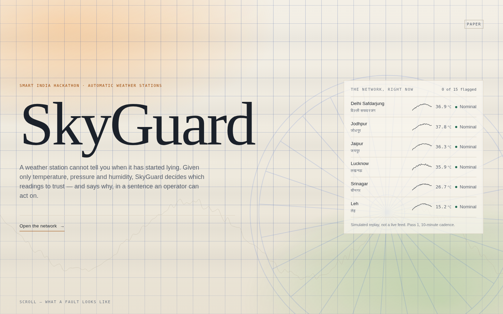
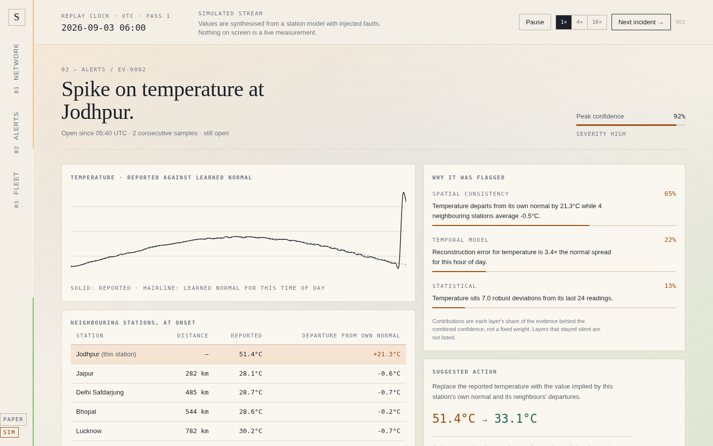
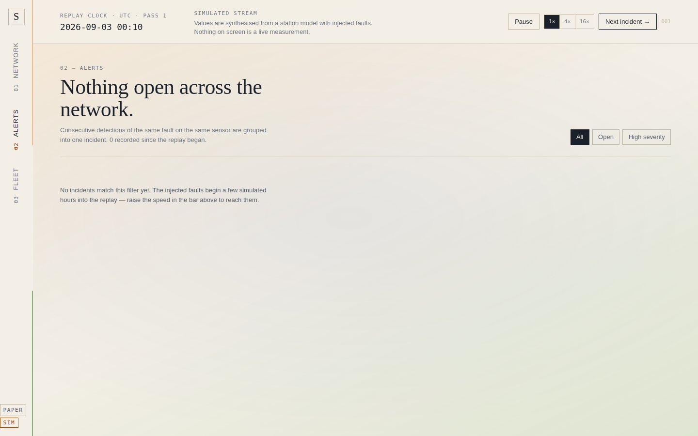

# SkyGuard

**Anomaly detection for Automatic Weather Stations, using only temperature, pressure and relative humidity.**

A weather station can't tell you when its readings have gone bad. SkyGuard watches a network of stations and flags
the readings it no longer trusts: spikes, frozen sensors, calibration drift, dropouts, and combinations
of values that are physically impossible. For each one it gives the reason in a sentence an operator can act on.

> **Prototype status.** This is a working web prototype built for Smart India Hackathon. Station IDs, names and
> coordinates are real NOAA ISD records. Every reading is **synthetic**: it comes from a station model with
> faults injected on a fixed schedule. Nothing on screen is a live measurement, and the UI says so.



## What the prototype shows

| View | Route | What it answers |
| --- | --- | --- |
| Cover | `/` | The pitch, a live preview of the network and the five fault signatures |
| Network | `/network` | Where: the map of India, the state of each station, and the stations that are flagged |
| Station | `/station/:id` | One station's three traces against its learned diurnal normal, plus a dewpoint check |
| Alerts | `/alerts` | What changed: consecutive detections grouped into incidents, with filters |
| Evidence | `/anomaly/:id` | Why: each detector layer's share of the evidence, the neighbours at onset, and a suggested replacement value |
| Fleet | `/edge` | Hardware: which layers can run on an ESP32-class station, the power budget, and which sites need a visit |

| Evidence | Alerts |
| --- | --- |
|  |  |

## Run it locally

Requires Node.js 20.19 or newer.

```bash
cd web
npm install
npm run dev          # http://localhost:5180
```

To serve a production build: `npm run build && npm run preview` (serves on http://localhost:4180).

To share your local dev server over a tunnel (ngrok, cloudflared), allow the tunnel's hostname:

```bash
SKYGUARD_ALLOWED_HOSTS=your-subdomain.ngrok-free.dev npm run dev
```

## Deploy

The app is a static single-page app. On **Vercel**, import the repository and set **Root Directory** to `web`.
`web/vercel.json` handles the build and rewrites every route to `index.html`, so deep links such as
`/anomaly/EV-0002` work after a refresh.

Any other static host works too: run `npm run build` and serve `web/dist/`. Configure the host to fall back to
`index.html` for unknown paths.

## Demo script (about 3 minutes)

The replay is deterministic. The same faults appear at the same simulated times on every run, so you can
rehearse the demo and it will play out the same way live.

1. **Cover (`/`).** Read the thesis line. Scroll to show the five fault signatures. Click **Open the network**.
2. **Network.** Every station is nominal. Click **Next incident →** in the top bar. The replay runs forward
   until the detector raises something: Guwahati's humidity sensor has frozen.
3. Click **Next incident →** again to get Jodhpur's temperature spike. Click Jodhpur on the map or in the list
   to open the station view, where the reported trace leaves the learned normal.
4. **Alerts.** Open the Jodhpur incident. The evidence view shows why it was flagged: the physical layer
   (temperature jumped while the dewpoint didn't) and the spatial layer (its neighbours disagree), the
   neighbours' readings at onset, and the value SkyGuard suggests in its place.
5. On the evidence view, keep clicking **Next incident →** to go through the remaining faults. Each click
   opens the new incident's evidence: the Port Blair dropout, the Bhopal humidity sensor reading past
   saturation, and the Visakhapatnam pressure spike.
6. **Fleet.** Show which detector layers run on the station and which need the upstream service.

Other controls: **Pause/Resume**, and **1× / 4× / 16×** replay speed. The small button in the rail switches
between the paper (light) and console (dark) themes. Paper is the default because it holds up best on a projector.

### Injected fault schedule

Offsets are hours into the 24-hour replay window. The schedule is in `web/src/lib/simulate.js`.

| Station | Fault | Parameter | Window |
| --- | --- | --- | --- |
| Srinagar | Calibration drift | Pressure | 0 – 24 h, detected once it has built up |
| Guwahati | Frozen value | Humidity | 3 – 24 h |
| Jodhpur | Spike | Temperature | 5.5 – 6.4 h |
| Port Blair | Communication dropout | All | 8 – 9.6 h |
| Bhopal | Cross-parameter inconsistency | Humidity | 11 – 12.2 h |
| Visakhapatnam | Spike | Pressure | 16 – 16.3 h |

After 24 simulated hours the replay starts the day again (the "pass" counter in the top bar goes up).

## How detection works

`web/src/lib/detect.js` runs four layers in the browser on each 10-minute sample. The detector sees only the
observed readings, never the simulator's ground truth.

- **Statistical:** a robust z-score against a rolling 24-sample window, plus a stuck-value check.
- **Temporal:** how far the reading is from the diurnal normal learned for that hour from three days of history.
- **Physical:** whether temperature, pressure and humidity are thermodynamically consistent with each other
  (for example, dewpoint can't exceed temperature, and RH can't go above 100 %).
- **Spatial:** whether the station's departure from its own normal matches its nearest neighbours'. When
  the whole region moves together it's weather; when one station moves alone it's the sensor.

The layers are combined with a noisy-OR, so independent evidence adds up and one deterministic check can reach
high confidence by itself. Consecutive detections of the same fault are grouped into a single incident.

## Project layout

```
web/
  src/lib/stations.js   real NOAA ISD station registry (15 Indian stations)
  src/lib/simulate.js   synthetic signal model and fault schedule
  src/lib/detect.js     the four-layer detector
  src/lib/physics.js    dewpoint, RH and plausibility checks
  src/lib/useStream.jsx replay clock and state; the only place the UI reads data from
  src/lib/contract.js   the Reading / Detection payload contract
  src/routes/           the six views
  src/components/       map, traces, meters, shell
```

## Connecting real data

The UI reads data only through the `Reading` contract in `web/src/lib/contract.js`. To connect a live
detection service, replace the simulated `advance()` tick in `web/src/lib/useStream.jsx` with a WebSocket
or polling client that emits the same shape. No component needs to change.
